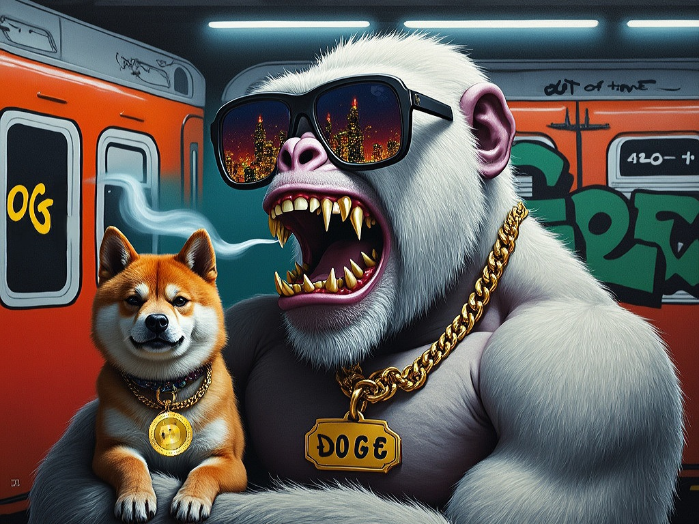
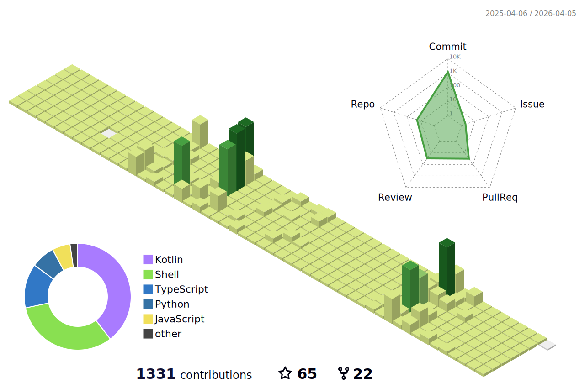
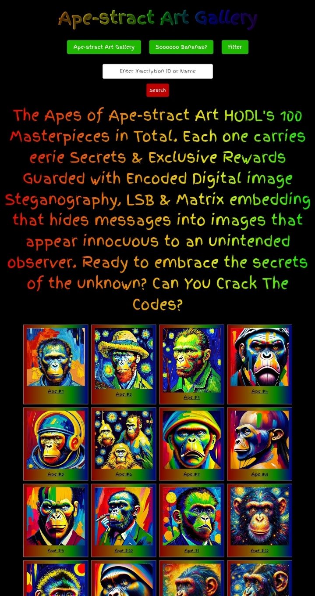
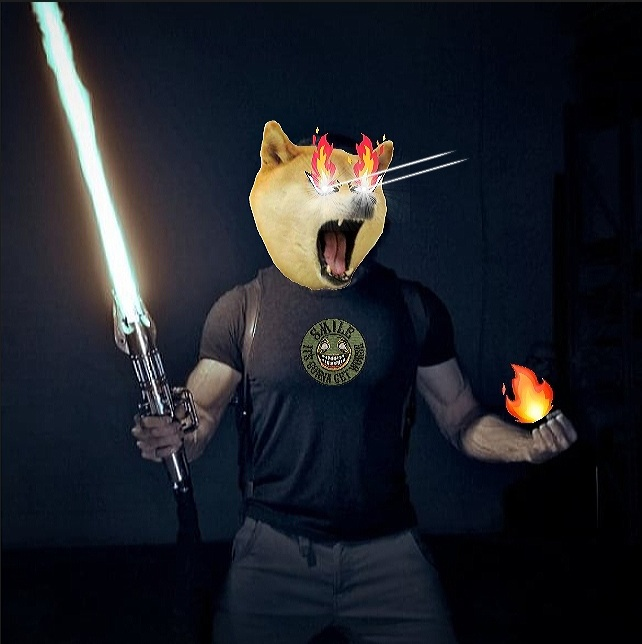

## 🐒 Hi, I’m @GreatApe42069

A 😎 Self-proclaimed Tech Genius, Full Blown Degen 🤪 slight Autist and Finance Rebel, I Give No advice, have No timing, I just HOĐL and if you're offended, it's a success. I'm a Trolls worst nightmare 😈 Cope Harder!
<h1 align="center">
   
  
    
  
  
</h1>

📢 Nominate ([@GreatApe42069](https://github.com/GreatApe42069)) as **[GitHub Star](https://stars.github.com/nominate)** if you appreciate my hard work and dedication to open source.

## Buy me a Coffee 

***Đoge: DC8iWykpcZS6HVZdCNLvJehunRyXotGoHH***

[**[Chat With Me](https://x.com/Greatape42069E)**]
[**[Work With Me](https://github.com/GreatApe42069)**]
[**[Newsletters](https://greatape42069.substack.com)**]
[**[Articles](https://x.com/Greatape42069E/articles)**]
[**[Telegram](https://t.me/GreatApe42069)**]

## 👀 Interests
- ✔️ Gaming 🎮 
- ✔️ Đogecoin 🐕 
- ✔️ Đoginals 🐶 
- ✔️ Cryptography 🔐
- ✔️ Cryptocurrencies ⛓
- ✔️ Web3 💻
- ✔️ Digital Art 🖼
- ✔️ I like to BUIĐL things 🔨
- ✔️ Helping others 🫂
- ✔️ UTXOs ⛓
- ✔️ Anything Open Sourced 📂
- ✔️ Truth 💯
- ✔️ Coding 👨‍💻
- ✔️ Self-education and self-development: Continuously seek opportunities for personal growth, self-improvement, and acquiring new knowledge and skills to stay at the forefront of industry trends and advancements 🤴
- ✔️ Family: Place great importance on nurturing and cherishing family bonds, fostering strong relationships, and maintaining a healthy work-life balance to support personal well-being and fulfillment 👨‍👩‍👧‍👦
- ✔️ Sports (motocross, football, basketball, baseball): Engage in physical activities 🏈🏀⚾️

## 🌱 Currently Learning
- Everything that I can about everything I can

## 💞️ Collaboration
- I’m open to collaborate, just shoot me a message

## 📫 Contact
- Email: GreatApe42069@proton.me

## Skills
- 👨‍💻 HyperIntelligence
- 👨‍💻 MicroStrategy Desktop
- 🎨 Painting
- 💯 Ethics
- 🔨 Carpentry
- 🖼 Art Appreciation
- ✍ Resume Writing
- ⌨ Typing
- 🤝 Negotiation
- 🤹‍♂️ Skilled Multi-tasker
- 📥 Order Processing
- 🤳 Customer Satisfaction
- 🤳 Customer Interaction
- 🤳 Customer Service
- 🤳 Customer Experience
- 📸 Webcam Minutes
- 🛰 Communication
- 💻 Laptops
- 💾 Desktop Computers
- 🤳 Customer Support
- 🧠 Problem Solving
- 🛰 Broadband Access
- ⛓ Cryptocurrency
- 🤖 Artificial intelligence LLMs
- ✍ Prompt writing
- 👨‍💻 JavaScript
- 👨‍💻 Python
- 👨‍💻 React
-👨‍💻 HTML
- 👨‍💻 Typescript
- 👨‍💻 Full stack Development

## Experience
- ⭐ Co-founder and co-creator of 5 Web2 and 3 Web3 projects.
- ⭐ Worked on innovative and cutting-edge projects
- ⭐ Contribute to industry thought leadership
- ⭐ Contribute to open source and private source
- ⭐ Master new technologies, master computer science and mathematics.

## Big believer in:
- 💡 Power of continuous learning and personal growth
- 💡 Importance of cultivating a positive mindset and embracing optimism
- 💡 Value of hard work and perseverance in achieving success
- 💡 Power of empathy and kindness in fostering meaningful connections and creating a harmonious society
- 💡 Importance of ethical behavior and integrity in all aspects of life.

## Certifications
- ARTH101: Art Appreciation - Saylor Academy
- BUS200: Business Ethics - Saylor Academy
- BUS401: Management Leadership - Saylor Academy
- CS120: Bitcoin for Developers I - Saylor Academy
- PRDV151: Bitcoin for Everybody - Saylor Academy
- PRDV102: Resume Writing - Saylor Academy

## Resume
- [View my resume on LinkedIn](https://www.linkedin.com/in/michael-harmon-19565a266/detail/featured-list?trk=featured-list)

## GitHub Stats:

| Repository Performance Stats - Last 28 days | Active Contributors - Last 28 days |
| ------------------------------------------- | ---------------------------------- |
|  |  |

| Star Geographic Distribution | Star History |
| ----------------------------- | ------------ |
|  |  |

| Pull Request Size | Pull Request Lifecycle |
| ----------------- | ---------------------- |
|  |  |

| Currently Working On - Last 28 days | Top Active Contributors - Last 28 Days |
| ----------------------------------- | -------------------------------------- |
|  |  |

| Repository Annual Ranking |
| ------------------------- |
|  |

## Featured Repositories:

## Primary Technology Stack:

 

## 🥇 Personal Stats:
With over 36 years of Đegenerate experience in Shaking shit up with Full Stack Development, Artificial Intelligence, and Cryptocurrency technologies.

---

## Visualize My Contributions

## Trophies 

 
 Github Profile Trophies
  

## Star History

## My Doginal Art Collection:
### Official Ape-stract Art Links 🔗
 
**Socials**
- [X](https://x.com/Ape_stract_Art)
- [Telegram](https://t.me/Ape_stract_Art_HODLers_Chat)

**Markets**
- [Doggy Market](https://doggy.market/nfts/ape-stract-art)
- [Ordinal Wallet](https://doge.ordinalswallet.com/collection/ape-stract-art)
- [DRC-20 Marketplace](https://drc-20.org/marketplace/doginals/ape-stract-art)
- [Doge Labs](https://doge-labs.com/#/collectible/ape-stract-art)

**OnChain Art Gallery**
- [Wonky Ord](https://wonky-ord.dogeord.io/content/d2f3a4a2945d3fbaa62664f4eea6634fb9828ec2285fcddcec5d86764f5b433bi0)
- [Doggy Market](https://cdn.doggy.market/content/d2f3a4a2945d3fbaa62664f4eea6634fb9828ec2285fcddcec5d86764f5b433bi0)

# Thanks for visiting!
## Counting of visitors to this page in this section started from Feb 14, 2025

# Đo Only Good Everyday

## Tip Me:
- 💰 Tip me in Đoge: [Mydoge.com/GreatApe42069](https://Mydoge.com/GreatApe42069)
- 💰 Tip me in Đoge: **DC8iWykpcZS6HVZdCNLvJehunRyXotGoHH**
- 💰 Tip me in ETH: greatape42069.eth
- 💰 Tip me in Bitcoin: **bc1qat83z6s52ax9krl08tr6x0njuex93zutqryr5z**

 
 

    WOOF!
 

<!---
GreatApe42069/GreatApe42069 is a ✨ special ✨ repository because its `README.md` (this file) appears on your GitHub profile.
You can click the Preview link to take a look at your changes.
--->
